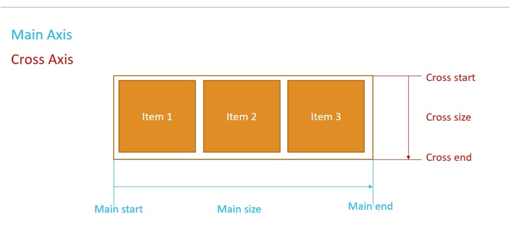

# Flexbox


## Mi az a Flexbox?


CSS Flexible box module: egy dimenziós layout modell
* rugalmas és hatékony elrendezés
* kiterjesztett hely az elemek között
* kontrolálni az elemek elhelyezkedését


## Miért a Flexbox?


* nagy rugalmasságot biztosít
* segít elemek elhelyezkedésének kezelésében
* segít az elemek közti tér könnyebb kezelésében
* segít az elemek sorrendjének kezelésében
* segít az elemek igazításának kezelésében
* a Bootstrap 4 is a flexboxra épül


## Layout modell


1. ```block```: weblapon lévő szekciókhoz
2. ```inline```: weblapon lévő szöveghez
3. ```table```: két dimenziós adattáblákhoz
4. ```positioned```: egy elem explicit pozíciójának megadásához

## Terminológia


Megkülönböztetünk ```flex konténer```-t és ```flex elem```-et.
```html
  <div class="flex-container">
    <div> Item 1 </div>
    <div> Item 2 </div>
    <div> Item 3 </div>
  </div>
```

## Flexbox tengelyek




* ```Main axis``` - balról jobbra haladva a képernyőn
  * ```Main start``` - kezdeti pont
  * ```Main end``` - végpont
  * ```Main size``` - kezdeti és végpont közti távolság
* ```Cross axis``` - fentről lefele haladva a képernyőn
  * ```Cross start``` - kezdeti pont
  * ```Cross end``` - végpont
  * ```Corss size``` - kezdeti és végpont közti távolság


## Flex konténer tulajdonságai


1. ```display``` - segítségével blokk vagy sorfolytonos elhelyezkedést állíthatunk be az elemeknek a flex konténeren belül. Értéke:
   1. ```flex```
   2. ```inline-flex```
2. ```flex direction``` - a főtengely (_main axis_) állíthatjuk be a segítségével. Értékei:
   1. ```row``` - balról jobbra (default)
   2. ```row-reverse``` - jobbról balra
   3. ```column``` - fentről lefele
   4. ```column-reverse``` - lentről felfele
3. ```flex wrap``` - az elemek wrappelését kontrollálja a konténeren belül. Értékei:
   1. ```nowrap```
   2. ```wrap```
   3. ```wrap-reverse```
4. ```flex flow``` - a ```flex direction``` és a ```flex wrap``` egybevont változata.
   * ```flex-flow: <flex-direction> <flex-wrap>```
   * alapértelmezetten ```row``` és ```no-wrap```
5. ```justify content``` - elemek igazítása és a köztük lévő távolság megosztása a konténerben. Az igazítás minden a főtengely (_main axis_) mentén történik. Értékei:
   1. ```flex-start```
   2. ```flex-end```
   3. ```center```
   4. ```space-between```
   5. ```space-around```
   6. ```space-evenly```
6. ```align-items``` - a kereszttengely mentén (_cross axis_) rendezi el az elemeket. Értékei:
   1. ```flex-start```
   2. ```flex-end```
   3. ```center```
   4. ```baseline```
   5. ```strech```
7. ```align-content``` - eligazítja a tartalmat a kereszttengely mentén és minden extra távolságot szét oszt a szülőkönténeren belül. Értékei:
   1. ```flex-start```
   2. ```flex-end```
   3. ```center```
   4. ```space-between```
   5. ```space-around```
   6. ```stretch```


## Flex elemek tulajonságai


1. ```order``` - kontrollálja az elemek sorrendjét a flex konténeren belül. Egy egész szám reprezentálja, ami alapértelmezetten 0, ha kettő vagy több elemnek azonos az értékei a sorrendet az fogja meghatározni, hogy a HTML-en belül melyik volt előbb definiálva.
2. ```flex-grow``` - meghatározza, hogy mekkora a rendelkezésre álló szabad hely a flex konténeren belül, amit az elem felvehet. Relatív az értéke a többi elemhez képest. Egy egész szám reprezentálja, ami alapértelmezetten 0. Ez azt jelenti, hogy az elemek nem fognak nőni. Ha az érték 1, akkor az elemek egyformán fognak növekedni.
3. ```flex-shrink``` - az elemek zsugorodását határozza meg, ha az elemek alapértelmezett értéke nagyobb, mint a flex konténeré. Relatív a többi elemhez képest a konténeren belül. Alapértelmezett értéke az 1.
4. ```flex-basis``` - a flex elemek kezdeti méretét határozza meg. Megadható pixelben, százalékban vagy relatív egységekben. Alapértelmezett értéke az ```auto```.
5. ```flex``` - a ```flex-grow```, ```flex-shrink``` és a ```flex basis``` összevont változata. Alaprételmezett érétkei a ```0 1 auto```
```css
.item {
  flex-grow: 2;
  flex-shrink: 5;
  flex-basis: 200px;
}
```

```css
.item {
  flex: 2 5 200px;
}
```
 A fent látható két változat funcionalitásban teljesen ekvivalens.

6. ```align-self``` - külön-külön igaztítja el az elemeket. Az olyan értékek, mint az ```auto```, ```flex-start```, ```flex-end```, ```center``` és a ```stretch``` felülírják az elemek elhelyezkedésének értékét a konténeren belül.


## Néhány felhasználási mód


* [Navigation bar](https://github.com/gyenattila/Web1/tree/master/FlexBox/navBar)
* [Centering item](https://github.com/gyenattila/Web1/tree/master/FlexBox/centerItem)
* [Unequal height columns and card footers](https://github.com/gyenattila/Web1/tree/master/FlexBox/variableHeight)
* [Holy Grail layout](https://github.com/gyenattila/Web1/tree/master/FlexBox/holyGrailGrid)


